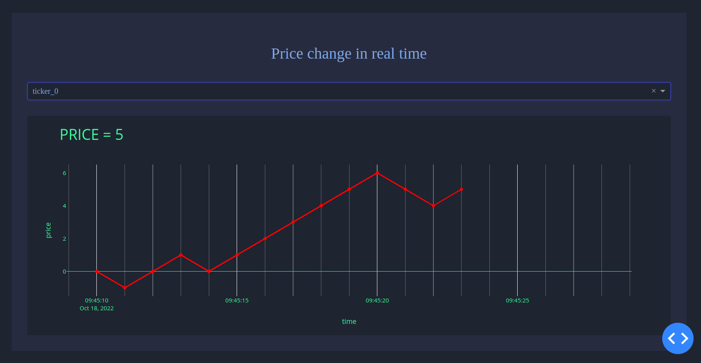

# RealTimePrice #


## Содержание репозитория

- [assets](assets) - директория для вспомогательных файлов (.css, .js)
- [app.py](app.py) - основной модуль для запуска приложения
- [utils.py](utils.py) - утилиты
- [Dockerfile](Dockerfile) - докер образ приложения
- [docker-compose.yml](docker-compose.yml) - compose файл для развертывания системы
- [requirements.txt](requirements.txt) - необходимые пакеты для установки


## Начало работы

### Установка Docker Engine

Установка производится в соответствии с инструкцией https://docs.docker.com/engine/install/ubuntu/
Перед установкой Docker Engine необходимо установить вспомогательные пакеты и добавить docker репозиторий:

```console
sudo apt-get update

sudo apt-get install \
  apt-transport-https \
  ca-certificates \
  curl \
  gnupg-agent \
  software-properties-common

curl -fsSL https://download.docker.com/linux/ubuntu/gpg | sudo gpg --dearmor -o /usr/share/keyrings/docker-archive-keyring.gpg

echo \
  "deb [arch=amd64 signed-by=/usr/share/keyrings/docker-archive-keyring.gpg] https://download.docker.com/linux/ubuntu \
  $(lsb_release -cs) stable" | sudo tee /etc/apt/sources.list.d/docker.list > /dev/null
```

Установка Docker Engine:

```console
sudo apt-get update
sudo apt-get install docker-ce docker-ce-cli containerd.io
```

Команда проверки установки:

```console
sudo docker run hello-world 
```

### Установка Docker Compose

Для установки Docker-compose лицензионных отчислений не требуется. 
Установка производится в соответствии с инструкцией https://docs.docker.com/compose/install/
Для установки Docker Compose требуется скачать последнюю версию docker-compose:

```console

sudo curl -L "https://github.com/docker/compose/releases/download/1.29.2/docker-compose-$(uname -s)-$(uname -m)" \
  -o /usr/local/bin/docker-compose
sudo chmod +x /usr/local/bin/docker-compose
sudo ln -s /usr/local/bin/docker-compose /usr/bin/docker-compose
```

Команда проверки установки:

```console
docker-compose --version
```

## Локальный запуск системы

Для развертывания системы необходимо выполнить команду:

```console
docker-compose -f docker-compose.yml up -d --build
```

Проверить успешность запуска можно командой:
```console
docker ps
```
Все компоненты системы должны иметь UP статус, после чего доступ к приложению будет по URL [http://localhost:8000](http://localhost:8000). 

> Если падает разворачивание, значит 8000 занят и нужно установить другой внешний порт, например, `8001:8001`. В URL, соответственно, также изменится порт.

